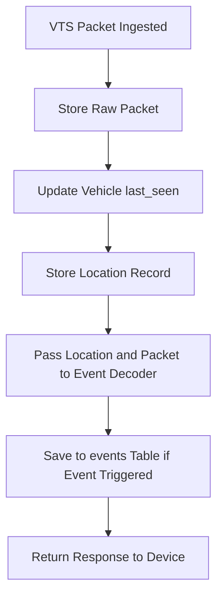

# Phase 1: VTS Architecture Review & Codebase Audit

This document presents a comprehensive review of the Vehicle Tracking System (VTS) codebase architecture, documenting the telemetry flow, database models, dashboard interface, and integration points for the upcoming Event Engine and Alert System.

---

## 1. Project Directory Structure
The current workspace is organized as follows:

```text
GPS_Project/
├── alembic/                      # Database migrations folder
│   ├── versions/                 # Version scripts (001_initial_migration, 002_timezone_aware)
│   ├── env.py                    # Alembic migration execution script
│   └── script.py.mako            # Alembic migration template file
├── app/                          # FastAPI Backend Application
│   ├── crud/                     # DB query helper functions
│   │   ├── __init__.py           # Exports CRUD operations
│   │   ├── location.py           # CRUD methods for location processing & telemetry logic
│   │   └── vehicle.py            # CRUD methods for vehicles profile setup
│   ├── models/                   # SQLAlchemy Database Models
│   │   ├── __init__.py           # Registers and exports models
│   │   ├── location.py           # Locations table representation
│   │   ├── raw_packet.py         # Raw audit log representation
│   │   └── vehicle.py            # Vehicles profile representation
│   ├── routers/                  # API Route Controllers
│   │   ├── __init__.py           # Exports routers
│   │   ├── health.py             # Health check & system stats endpoints
│   │   ├── location.py           # Ingestion pipeline & location query endpoints
│   │   └── vehicle.py            # Vehicle registration & profile management endpoints
│   ├── schemas/                  # Pydantic schemas for request validation & serialization
│   │   ├── __init__.py           # Exports schemas
│   │   ├── location.py           # Location serialization rules
│   │   ├── vehicle.py            # Vehicle profile input/output validation
│   │   └── vts.py                # VTS Packet telemetry protocol validation
│   ├── config.py                 # Pydantic settings loading from environmental variables
│   ├── database.py               # Synchronous & Asynchronous engine/session setup
│   ├── exceptions.py             # Custom API exceptions and handlers
│   ├── logging_config.py         # Backend logging configurations
│   └── main.py                   # Main FastAPI entry point containing routes registration
├── dashboard/                    # Next.js 15 App Router Frontend
│   ├── app/                      # Page views
│   │   ├── analytics/            # Analytics charts and summaries page
│   │   ├── explorer/             # Paginated database explorer page
│   │   ├── packets/              # Live raw packets debugging dashboard page
│   │   ├── vehicles/             # Vehicles inventory and single vehicle tracker pages
│   │   ├── globals.css           # Vanilla styling configurations
│   │   ├── layout.tsx            # Main HTML template wrapper
│   │   └── page.tsx              # Overview page containing fleet statistics
│   ├── components/               # React reusable interfaces
│   │   ├── charts.tsx            # Analytics chart representations using Recharts
│   │   ├── sidebar.tsx           # Main navigation layout side drawer
│   │   └── ui/                   # Shadcn/ui core components
│   ├── lib/                      # Helper libraries
│   │   ├── api.ts                # Frontend HTTP fetch client
│   │   └── utils.ts              # Styling utilities
│   ├── types/                    # TypeScript interfaces
│   │   └── index.ts              # Global type definitions
│   ├── package.json              # Frontend dependency configurations
│   ├── tsconfig.json             # TypeScript configurations
│   └── tailwind.config.js        # CSS styling rules configurations
├── scripts/                      # Utility scripts
│   ├── db_test.py                # Test script to confirm DB connection
│   └── telemetry_simulator.py    # Python simulator for Gujarat routes telemetry POSTs
├── alembic.ini                   # Alembic configurations file
├── requirements.txt              # Backend python libraries list
├── .env                          # Local credentials file (ignored in git)
└── REVIEW_PACKAGE.md             # Review briefing context file
```

---

## 2. Telemetry & Ingestion Data Flow
The current flow for telemetry ingestion operates synchronously:

```mermaid
sequenceDiagram
    participant Tracker as Hardware / Simulator
    participant Ingestion as Ingestion API (POST /vts/telemetry)
    participant CRUD as process_vts_telemetry()
    participant DB as PostgreSQL Database

    Tracker->>Ingestion: Sends JSON payload (VTSPacket)
    Note over Ingestion: Validated via Pydantic VTSPacket schema
    Ingestion->>CRUD: Delegates to CRUD layer
    
    rect rgb(20, 30, 50)
        Note over CRUD: DB Transaction Starts
        CRUD->>DB: Check for duplicate msgid in raw_packets
        DB-->>CRUD: Return duplicate status (if yes, exit early)
        
        CRUD->>DB: Check if vehicle exists by device_uid
        alt Vehicle Not Found
            CRUD->>DB: Auto-registers vehicle
        end
        
        CRUD->>DB: Insert Location Record (latitude, longitude, speed, alt, timestamp, extra_data)
        CRUD->>DB: Update Vehicle's last_seen timestamp
        CRUD->>DB: Insert raw JSON string into raw_packets
        CRUD->>DB: Commit Transaction
    end

    CRUD-->>Ingestion: Return Success Status
    Ingestion-->>Tracker: Respond 200 OK {"result": true, "msg": "Data Success"}
```



### Telemetry Packet Elements
* **`uid`**: Device unique hardware identifier.
* **`info.dt`**: Unix epoch timestamp (converted to naive UTC `datetime`).
* **`info.txn`**: Transmission reason identifier (e.g., `'A'`, `'E'`).
* **`gps.loc`**: Coordinates array `[latitude, longitude]`.
* **`gps.speed`**: Current speed in km/h.
* **`gps.alt`**: Altitude in meters.
* **`io`**, **`pwr`**, **`dbg`**: Digital/analog IO metrics, battery voltage/status, and debug libraries stored as a JSON object inside `locations.extra_data`.

---

## 3. Database Schema Overview
The system currently uses three tables:

### 1. `vehicles`
Stores device profiles and connection statuses:
* `id` (Integer, Primary Key)
* `device_uid` (String, Unique, Indexed, Nullable=False)
* `vehicle_name` (String, Nullable=False)
* `vehicle_type` (String, Nullable=False)
* `created_at` (DateTime, Default=UTC, Nullable=False)
* `last_seen` (DateTime, Nullable=True)

### 2. `locations`
Stores processed coordinates and time-series data:
* `id` (Integer, Primary Key)
* `vehicle_id` (Integer, ForeignKey to `vehicles.id`, Cascade Delete, Indexed, Nullable=False)
* `latitude` (Float, Nullable=False)
* `longitude` (Float, Nullable=False)
* `speed` (Float, Nullable=False)
* `altitude` (Float, Nullable=False)
* `timestamp` (DateTime, Indexed, Nullable=False)
* `extra_data` (JSONB, Nullable=True)

### 3. `raw_packets`
Append-only log containing audit trail data:
* `id` (Integer, Primary Key)
* `device_uid` (String, Indexed, Nullable=True)
* `message_id` (Integer, Indexed, Nullable=True)
* `packet_data` (JSONB, Nullable=False)
* `created_at` (DateTime, Default=UTC, Indexed, Nullable=False)

---

## 4. Frontend Dashboard Architecture
The Next.js frontend has a modular structure built on React 18 and Next.js 15:
* **State Management**: Maintained locally in page routes using standard React hooks (`useState`, `useEffect`, `useCallback`).
* **Telemetry Data Querying**: The dashboard polls the FastAPI backend every **10 seconds** using a traditional `setInterval` loop in the main `/` page, `/vehicles/[id]` details viewer, `/explorer` DB list, and `/packets` logs viewer.
* **API Client**: Defined in `dashboard/lib/api.ts`, which makes fetch calls to `/system/stats`, `/vehicles`, `/locations/history/`, and `/vts/raw-packets`.
* **Theme Styling**: Features a dark blue space-themed dashboard (`bg-[#0b0f19]`, glass panels, custom card elements) with standard Tailwind components.

---

## 5. Potential Integration Points for the Event Engine & Alert System
To add events without disrupting the ingestion process, the event decoder must be executed sequentially *after* database storage, but within the same database transaction to guarantee ACID consistency, or handled asynchronously as a background task. 



### Critical Integration Steps:
1. **Model Addition**: Add an `Event` model in `app/models/event.py` representing the new `events` table.
2. **Schema Definition**: Add event schemas in `app/schemas/event.py` for request validation and API serialization.
3. **Ingestion Hook**: Inject the `EventDecoder` call right after the `Location` record has been constructed and added to the database session inside `process_vts_telemetry()`.
4. **CRUD Layer & Routers**: Create new endpoints under `app/routers/event.py` and query logic under `app/crud/event.py` to retrieve events based on filters (severity, vehicle ID, pagination).
5. **Dashboard Incorporation**: Introduce a "Recent Events" widget on the overview page and corresponding statistics boxes.

---

## 6. Pre-Implementation Risk Analysis

> [!WARNING]
> ### 1. Time-series Table Scaling
> The `locations` and `raw_packets` tables are written to continuously. At 5 active vehicles transmitting every 10 seconds, that equates to ~43,200 records per day. If scaled to 1,000 vehicles, this will exceed 8.6 million inserts per day.
> * **Mitigation**: Introduce TimescaleDB hypertable setups or partition the `locations` table by range of `timestamp` (e.g. monthly) soon.

> [!WARNING]
> ### 2. Synchronous Transaction Ingestion Overhead
> Storing the raw packet, logging location, auto-registering vehicles, parsing, and now executing event checks are all performed synchronously in the HTTP thread under a single database lock transaction. If any database lag occurs, the ingestion request times out, leading to packet drops.
> * **Mitigation**: Keep event parsing extremely lightweight (O(1) checks). In the future, move event decoding and database persistence to an asynchronous worker queue (Celery/Redis or asyncio background tasks).

> [!IMPORTANT]
> ### 3. Absence of Device Authentication
> Telemetry ingestion is completely open. Anyone can POST random coordinates to `/vts/telemetry` which auto-registers arbitrary vehicle UIDs.
> * **Mitigation**: Implement API key check or parse the `Authorization` header which can be configured via the `HEADER` VTS command in physical hardware.

> [!NOTE]
> ### 4. Naive Datetime Comparison
> The database stores naive datetimes matching UTC timezone. Python code strips timezone information during comparisons. This can trigger subtle drift errors if local server system times do not match UTC. We will strictly use UTC timezone-naive representations for the database elements to match the existing model convention.
